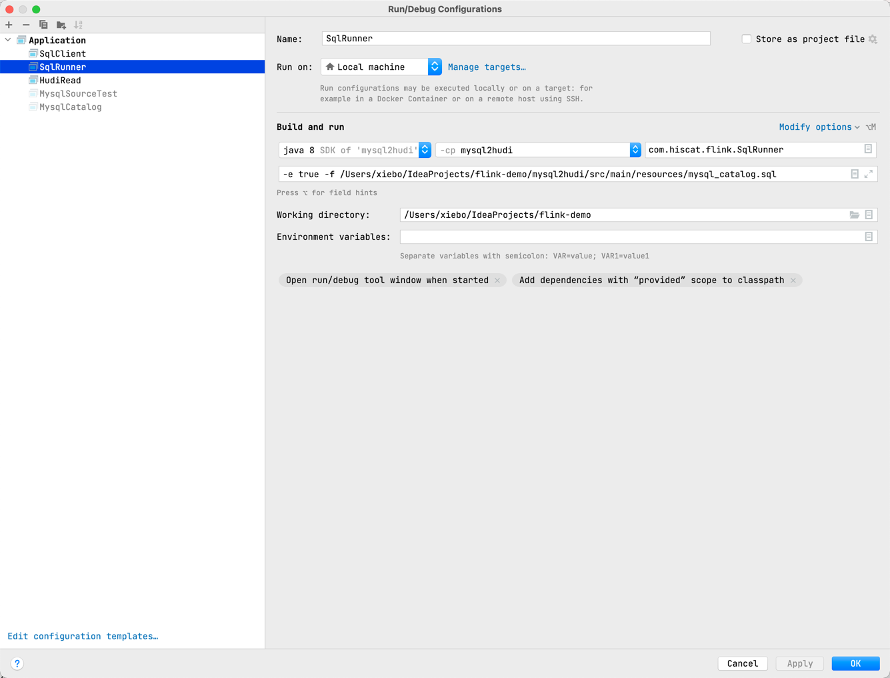

# flink-demo

minimum code just run

## flink-ds-connector

DataStream API usage

*  [ kafka](./flink-ds-connector/src/main/scala/com/hiscat/flink/ds/connector/kafka )
*  [ es ](./flink-ds-connector/src/main/scala/com/hiscat/flink/ds/connector/es )
*  [ jdbc ](./flink-ds-connector/src/main/java/com/hiscat/flink/ds/connector/jdbc )
*  [ file ](./flink-ds-connector/src/main/scala/com/hiscat/flink/ds/connector/file )
    *  [ row string ](./flink-ds-connector/src/main/scala/com/hiscat/flink/ds/connector/file/RowEncodeFormat.scala )
    *  [ parquet avro ](./flink-ds-connector/src/main/scala/com/hiscat/flink/ds/connector/file/ParquetAvroWriterTest.scala )
    *  [ avro ](./flink-ds-connector/src/main/scala/com/hiscat/flink/ds/connector/file/AvroWriterTest.scala )
    *  [ custom avro ](./flink-ds-connector/src/main/scala/com/hiscat/flink/ds/connector/file/CustomAvroWriterTest.scala )

## flink-sql-connector

SQL usage

*  [ print](./flink-sql-connector/src/main/resources/sql/print.sql )
*  [ blackhole](./flink-sql-connector/src/main/resources/sql/blackhole.sql )
*  [ datagen](./flink-sql-connector/src/main/resources/sql/datagen.sql )
*  jdbc
    *  [ scan ](./flink-sql-connector/src/main/resources/sql/jdbc_scan.sql )
    *  [ lookup ](./flink-sql-connector/src/main/resources/sql/jdbc_lookup.sql )
    *  [ batch sink ](./flink-sql-connector/src/main/resources/sql/jdbc_batch_sink.sql )
    *  [ streaming sink ](./flink-sql-connector/src/main/resources/sql/jdbc_streaming_sink.sql )
*  es
    *  [ batch sink ](./flink-sql-connector/src/main/resources/sql/es6_batch_sink.sql )
    *  [ streaming sink ](./flink-sql-connector/src/main/resources/sql/es6_streaming_sink.sql )
*  hbase
    *  [ lookup ](./flink-sql-connector/src/main/resources/sql/hbase_lookup_source.sql )
    *  [ scan ](./flink-sql-connector/src/main/resources/sql/hbase_scan_source.sql )
    *  [ batch sink ](./flink-sql-connector/src/main/resources/sql/hbase_batch_sink.sql )
    *  [ streaming sink ](./flink-sql-connector/src/main/resources/sql/hbase_streaming_sink.sql )
*  kafka
    *  [ streaming sink ](./flink-sql-connector/src/main/resources/sql/kafka_streaming_sink.sql )
    *  [ scan source ](./flink-sql-connector/src/main/resources/sql/kafka_scan_source.sql )
*  upsert-kafka
    *  [ streaming sink ](./flink-sql-connector/src/main/resources/sql/upsert_kafka_streaming_sink.sql )
    *  [ scan source ](./flink-sql-connector/src/main/resources/sql/upsert_kafka_scan_source.sql )
*  filesystem
    *  [ streaming sink ](./flink-sql-connector/src/main/resources/sql/fs_streaming_sink.sql )

### how to run sql

* cd flink-sql-parser
* mvn install -Dskip.Tests
* run [ SqlTest ](./flink-sql-connector/src/main/scala/com/hiscat/flink/sql/connector/SqlTest.scala )
   *  with --sql.path your sql file path

