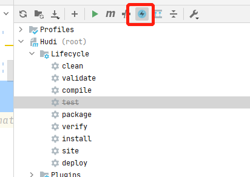
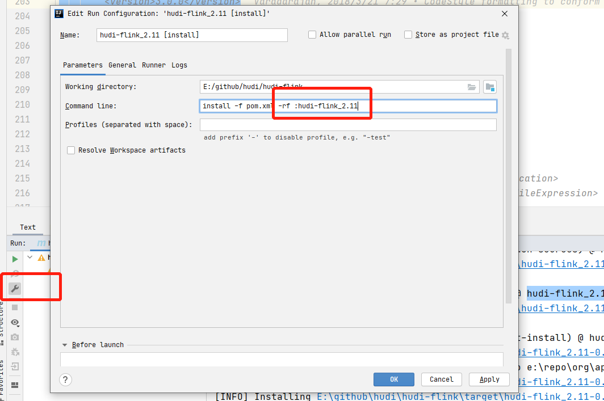
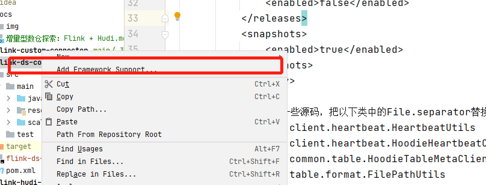
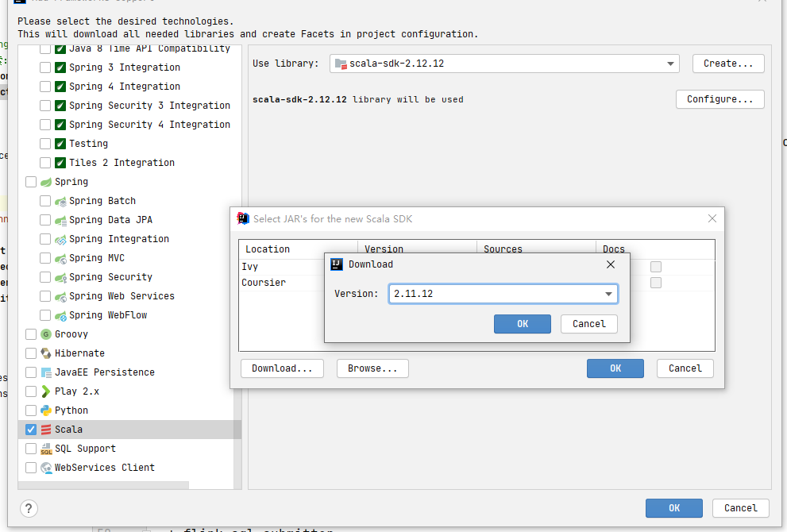
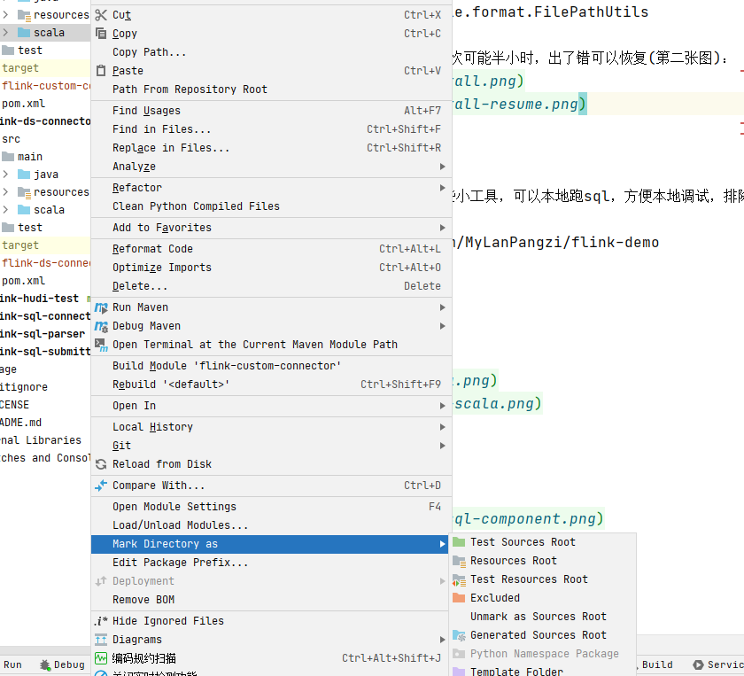
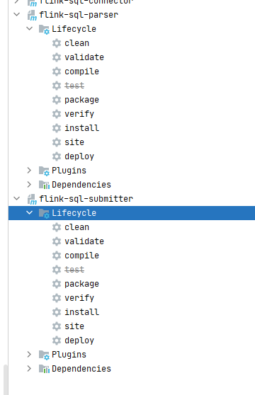
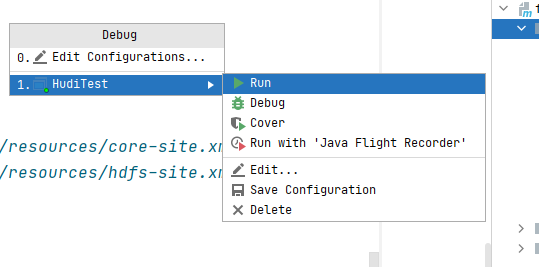
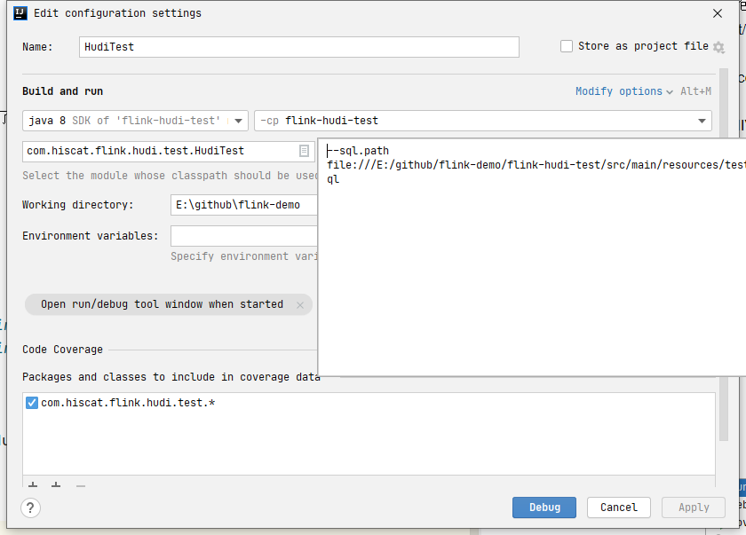
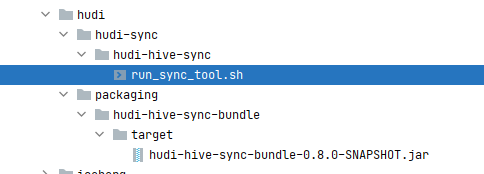
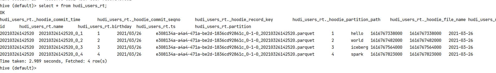

# 增量型数仓探索：Flink + Hudi + Hive

应用场景:
* mysql-cdc -> hudi -> hive

有问题可以来微信群：ApacheHudi国内技术交流2群，问我，或者在flink-demo下开个discussion

我的开发环境：
* OS: win10
* idea: 2020.3.3最终版
* jdk: 1.8.0_202-b08
* maven: apache-maven-3.6.3，注意配置自己的加速镜像
* scala: 2.11.12
* flink: 1.12.2
* hudi: master分支

## 准备工作

### 编译hudi

* 下载地址 https://github.com/apache/hudi
    * 慢的同学，注册个[Gitee](https://gitee.com/) 账号，从Gitee导入，然后再下载
    * 我的地址（不定期更新，可能不是最新的） https://gitee.com/geekXie/hudi
* 导入idea
* 修改顶层的pom.xml，注掉modules下几个模块（打包不需要）：
```xml
    <!--    <module>docker/hoodie/hadoop</module>-->
    <!--    <module>hudi-integ-test</module>-->
    <!--    <module>packaging/hudi-integ-test-bundle</module>-->
    <!--    <module>hudi-examples</module>-->
```
* 注释掉checkstyle插件，改了源码，编译有些报错：
  ```xml
   <groupId>org.apache.maven.plugins</groupId>
    <artifactId>maven-checkstyle-plugin</artifactId>
    <version>3.0.0</version>
  ```
* repositories下可能要加一些仓库地址，有些刁民jar包不太好下载，confluent，pentaho，下载不下来的，各显神通吧：
  ```xml
        <repository>
            <id>snapshots-repo</id>
            <url>https://oss.sonatype.org/content/repositories/snapshots</url>
            <releases>
                <enabled>false</enabled>
            </releases>
            <snapshots>
                <enabled>true</enabled>
            </snapshots>
        </repository>
  ```
* windows用户需要修改一些源码，把以下类中的File.separator替换成Path.SEPARATOR，这个是hadoop的类：
  * org.apache.hudi.client.heartbeat.HeartbeatUtils
  * org.apache.hudi.client.heartbeat.HoodieHeartbeatClient
  * org.apache.hudi.common.table.HoodieTableMetaClient
  * org.apache.hudi.table.format.FilePathUtils

* 开始install吧，看情况，首次可能半小时，出了错可以恢复(第二张图)：


  
### 配置flink-demo

一个探索flink的项目，写了一些小工具，可以本地跑sql，方便本地调试，排除依赖。

* 下载 https://github.com/MyLanPangzi/flink-demo
* 导入idea
* 需要配置scala，三个项目
  * flink-hudi-test
  * flink-sql-parser
  * flink-sql-submitter
  * 
  * 
  * 
* install
  * flink-sql-parser
  * flink-sql-submitter
  * 
  
### Hadoop集群

我的集群是vm上装的

版本：
* Hadoop3.1.4
* Hive3.1.2
  * PS: 因为冲突，我改了hive-exec.jar的内容，删掉了guava依赖，如果缺少guava依赖需要copy，hadoop下的guava包到hive的lib下
  * cp hive-exec-3.1.2.jar /opt/test
  * jar xf hive-exec-3.1.2.jar 
  * rm -rf hive-exec-3.1.2.jar com 
  * jar cf hive-exec-3.1.2.jar .
  * mv hive-exec-3.1.2.jar $HIVE_HOME/lib/
* MySQL5.7

注意权限配置，配置文件：
* [core-site.xml](../flink-hudi-test/src/main/resources/core-site.xml)
* [hdfs-site.xml](../flink-hudi-test/src/main/resources/hdfs-site.xml)

## 本地调试

### CDC写入Hudi
* 跑这个类就可以了 com.hiscat.flink.hudi.test.HudiTest
* 本次测试sql文件：[ mysql_cdc_test ](../flink-hudi-test/src/main/resources/mysql_cdc_test.sql)
* 注意修改响应参数，mysql账号需要reload权限，启动后，可以一条一条测试，看效果:
```sql
-- mysql 
create table users
(
	id bigint auto_increment
		primary key,
	name varchar(20) null,
	birthday timestamp default CURRENT_TIMESTAMP not null,
	ts timestamp default CURRENT_TIMESTAMP not null
);
insert into users (name) values ('hello');
insert into users (name) values ('world');
insert into users (name) values ('iceberg');
insert into users (id,name) values (5,'spark');

select * from users;
update users set name = 'hello spark'  where id = 5;
delete from users where id = 5;


```
* 启动参数配置sql文件的地址：




### 导入hive

* 这个jar包需要在hive/lib下或者aux jars路径：hudi-hadoop-mr-bundle-x.y.z-SNAPSHOT.jar
* 参考链接：http://hudi.apache.org/docs/querying_data.html#hive
* 上传脚本，脚本用我修改过的，每个hive版本的依赖不一样，需要根据报错信息具体修改。
* [ run_sync_tool ](../flink-hudi-test/src/main/resources/run_sync_tool.sh)
  * 加了calcite, libfb303依赖
* 上传jar包，路径要跟截图一样，或者修改这个变量
```shell
HUDI_HIVE_UBER_JAR=`ls -c $DIR/../../packaging/hudi-hive-sync-bundle/target/hudi-hive-sync-*.jar | grep -v source | head -1`
```
* 
* 执行导入，注意替换参数
```shell
./run_sync_tool.sh  --jdbc-url jdbc:hive2:\/\/yh001:10000 \
--user hdp \
--pass '' \
--partitioned-by partition \
--base-path hdfs://yh001:9820/hudi/hudi_users \
--database default \
--table hudi_users
```
* 查询，可以测试，mysql写入一条，更新一条，删除一条，看hive是不是实时更新的，延迟大概是chk的时间，我的是10S.
